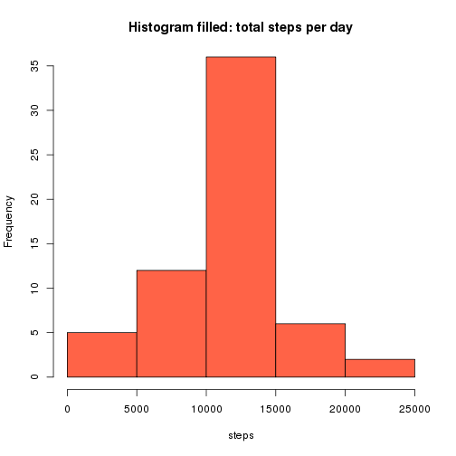

## What is mean total number of steps taken per day?


```r
library(ggplot2)
library(scales)
# Read the csv file
setwd("/home/cloudera/Desktop/repro_research/RepData_PeerAssessment1/")
activity <- read.csv("activity.csv")

# Calculate the total number of steps taken per day
aggr_activity <- aggregate(activity$steps, by=list(activity$date),sum)
colnames(aggr_activity) <- c("date","steps")

# Histogram
hist(aggr_activity$steps,xlab=c("steps"),main=c("Histogram: total steps per day"),col="blue",ylim = c( 0, 35 ))
```


```r
# Get the mean of total steps per day
activity_mean <- mean(aggr_activity$steps,na.rm = TRUE)
activity_mean
```

```
## [1] 10766.19
```

```r
# Get the median of total steps per day
activity_median <- median(aggr_activity$steps,na.rm = TRUE)
activity_median
```

```
## [1] 10765
```

```r
# mean and median in histogram
hist(aggr_activity$steps,xlab=c("steps"),main=c("Histogram: total steps per day (Zoom to show mean and median)"),col="blue",ylim = c( 0, 35 ),xlim = c( 10000, 12000 ))

abline(v = activity_median, col = "pink", lwd = 8)
abline(v = activity_mean, col = "green", lwd = 4)
legend("topright", c("median", "mean"), col=c("pink", "green"), lwd=10)
```


## What is the average daily activity pattern?

```r
# Remove NA rows and aggregate by inteval calculating the mean
activity_clean <- na.omit(activity)
# get the aggregate mean steps per interval
aggr_mean <- aggregate(activity_clean$steps, by=list(activity_clean$interval),mean)
colnames(aggr_mean) <- c("interval","steps")

# Plot mean steps per interval in a day
aggr_mean$time <- sprintf("%04d", aggr_mean$interval)
aggr_mean$time <- format(strptime(aggr_mean$time, format="%H%M"), format = "%H:%M")
aggr_mean$time <-  as.POSIXlt(aggr_mean$time,format="%H:%M")
ggplot(aggr_mean, aes(time, steps,group = 1) ) + geom_line() + scale_x_datetime(labels = date_format("%H:%M",tz="UTC-1"))
```


```r
# Get interval with maximum steps
interval <- aggr_mean[aggr_mean[,"steps"] == max(aggr_mean$steps),"interval"]
interval <- sprintf("%04d", interval)
format(strptime(interval, format="%H%M"), format = "%H:%M")
```

```
## [1] "08:35"
```

## Imputing missing values

```r
# Get the number of NA rows
sum(is.na(activity$steps))
```

```
## [1] 2304
```

```r
# Create an aggregate data.frame with the mean per day
mean_activity <- aggregate(activity$steps, by=list(activity$date),mean)
colnames(mean_activity) <- c("date","steps")

y <- is.na(activity$steps)==TRUE

activity_filled <- activity
activity_filled$steps[y] <- mean(activity_clean$steps)

aggr_activity_filled <- aggregate(activity_filled$steps, by=list(activity_filled$date),sum)
colnames(aggr_activity_filled) <- c("date","steps")

# Histogram
hist(aggr_activity_filled$steps,xlab=c("steps"),main=c("Histogram filled: total steps per day"),col="tomato",ylim = c( 0, 35 ))
```



```r
# Get the mean of total steps per day
activity_mean_filled <- mean(aggr_activity_filled$steps)
activity_mean_filled
```

```
## [1] 10766.19
```

```r
activity_mean
```

```
## [1] 10766.19
```

```r
# Get the median of total steps per day
activity_median_filled <- median(aggr_activity_filled$steps)
activity_median_filled
```

```
## [1] 10766.19
```

```r
activity_median
```

```
## [1] 10765
```

## Are there differences in activity patterns between weekdays and weekends?

```r
# include new column day indicating weekday or weekday
activity_filled$date <- as.Date(activity_filled$date)
activity_filled$day <- ifelse(weekdays(activity_filled$date) %in% c("Saturday", "Sunday"), "weekend", "weekday")
weekend <- subset(activity_filled, day =="weekend")
weekday <- subset(activity_filled, day =="weekday")


# get the aggregate mean steps per interval
aggr_mean_end <- aggregate(weekend$steps, by=list(weekend$interval),mean)
colnames(aggr_mean_end) <- c("interval","steps")

aggr_mean_day <- aggregate(weekday$steps, by=list(weekday$interval),mean)
colnames(aggr_mean_day) <- c("interval","steps")

# Plot mean steps per interval in a weekend day
aggr_mean_end$time <- sprintf("%04d", aggr_mean_end$interval)
aggr_mean_end$time <- format(strptime(aggr_mean_end$time, format="%H%M"), format = "%H:%M")
aggr_mean_end$time <-  as.POSIXlt(aggr_mean_end$time,format="%H:%M")
ggplot(aggr_mean_end, aes(time, steps,group = 1) ) + geom_line() + scale_x_datetime(labels = date_format("%H:%M",tz="UTC-1"))
```


```r
# Plot mean steps per interval in a weekday
aggr_mean_day$time <- sprintf("%04d", aggr_mean_day$interval)
aggr_mean_day$time <- format(strptime(aggr_mean_day$time, format="%H%M"), format = "%H:%M")
aggr_mean_day$time <-  as.POSIXlt(aggr_mean_day$time,format="%H:%M")
ggplot(aggr_mean_day, aes(time, steps,group = 1) ) + geom_line() + scale_x_datetime(labels = date_format("%H:%M",tz="UTC-1"))
```


